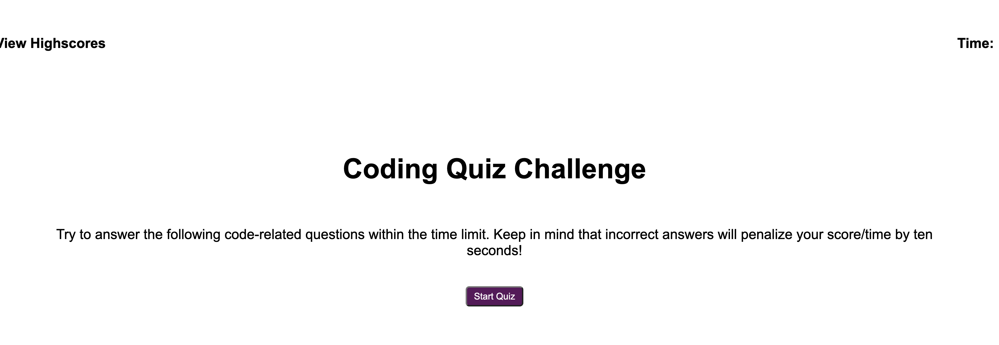
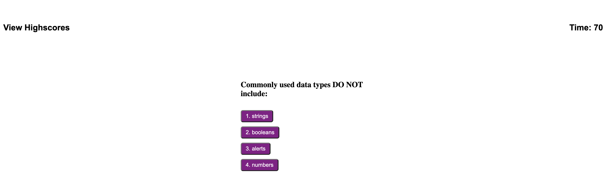
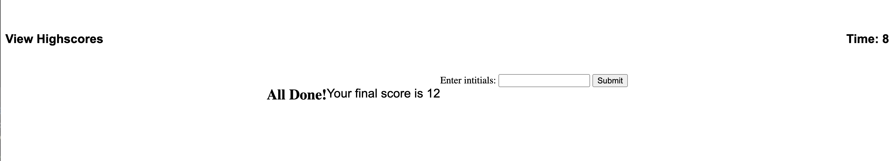

# 04 Web APIs: Code Quiz
Timed Coding Quiz

In this repository, please find revised files. I have attempted to satisfy the acceptance criteria in the following manner...
• When the 'Start' button is clicked on the 'introduction' screen, a timed-quiz begins; a timer (which serves as the user's 'score')
also begins counting down.
• On hover, buttons lighten in color and the box receiving the user's click receives a blue "glow" border.
• On hover over buttons, mouse "tooltip" changes to pointer finger.
• When the user answers a question, they alerted as to whether or not they answered correctly.
• When the user answers a question incorrectly, 10 seconds of time is subtracted from the clock/score. 
• When all questions are answered or the timer reaches 0, the user is alerted that the game is over.
• The user is then shown their score.
• Although a form for initials appears and accepts user inptu, I was unable to finish the last acceptance criteria.

• Here are Static screenshots of the quiz in action...

• Link to deployed 'Quiz': https://kpl33.github.io/timed_coding_quiz/